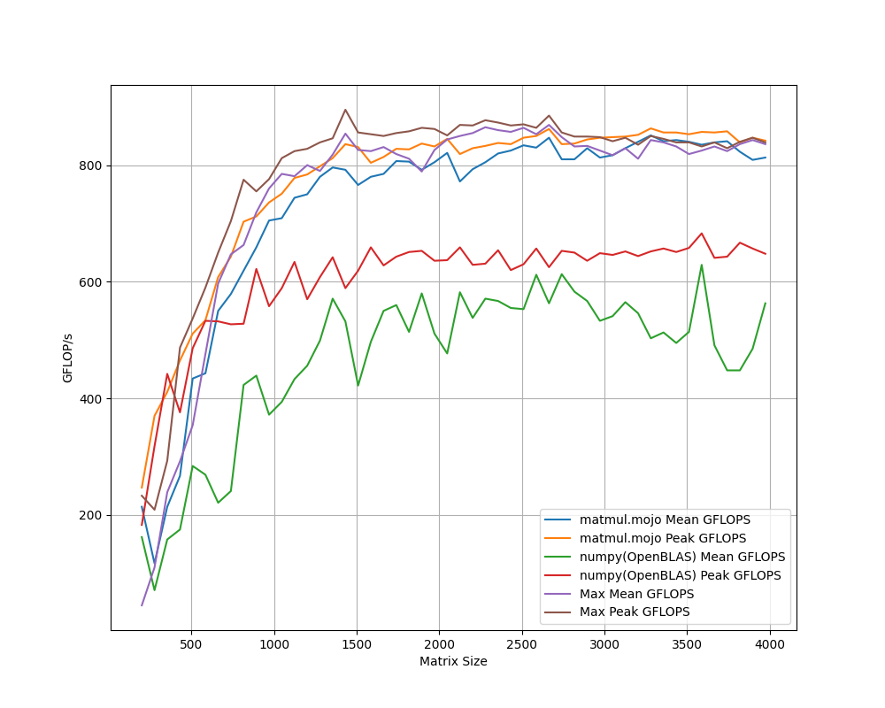

# Matmul.🔥 

Matmul.🔥 is a high performance muilti-threaded implimentation of the [BLIS](https://en.wikipedia.org/wiki/BLIS_(software)) algorithm in pure Mojo 🔥.


# Installation and Benchmark

1. Install [Max/Nightly](https://docs.modular.com/max/install#install-max).
2. Clone the repository:
```sh
git clone https://github.com/YichengDWu/matmul.mojo.git
```
3. Run `benchmark.mojo`
```sh
mojo run -I src matmul_benchmark.mojo
```

# Results

CPU info:
```
  Cpu Property       Value                                                     
  –––––––––––––––––– ––––––––––––––––––––––––––––––––––––––––––––––––––––––––––
  Brand              13th Gen Intel(R) Core(TM) i5-13600K                      
  Cores              14 physical cores, 20 logical cores (on executing CPU)    
                     Hyperthreading hardware capability detected               
  Clock Frequencies  3500 / 5100 MHz (base/max), 100 MHz bus                   
  Data Cache         Level 1:3 : (48, 2048, 24576) kbytes                      
                     64 byte cache line size                                   
  Address Size       48 bits virtual, 46 bits physical                         
  SIMD               256 bit = 32 byte max. SIMD vector size                   
  Time Stamp Counter TSC is accessible via `rdtsc`                             
                     TSC runs at constant rate (invariant from clock frequency)
  Perf. Monitoring   Performance Monitoring Counters (PMC) revision 5          
                     Available hardware counters per logical core:             
                     3 fixed-function counters of 48 bit width                 
                     6 general-purpose counters of 48 bit width                
  Hypervisor         No                                                    
```




Notes:
 - Hyberthreading is disabled.
 - Mojo only utilizes performance cores, while `numpy` utilizes all cores.
 - I use new matrices for each matrix multiplication instead of repeatedly iterating over the same matrices. This avoids the unrealistic assumption of high cache hit rates that may not occur in real-world scenarios.
 - You might want to change the parameters `L1_ASSOCIATIVITY`, `L1_CACHE_SIZE`, `L2_ASSOCIATIVITY` and `L2_CACHE_SIZE` according to your cache topology.
 - My implementation might assume that matrices A and B are row-major in some parts. I haven't thoroughly verified this. If you intend to compute A*B^T (as commonly in neural networks), it might not produce the correct results.